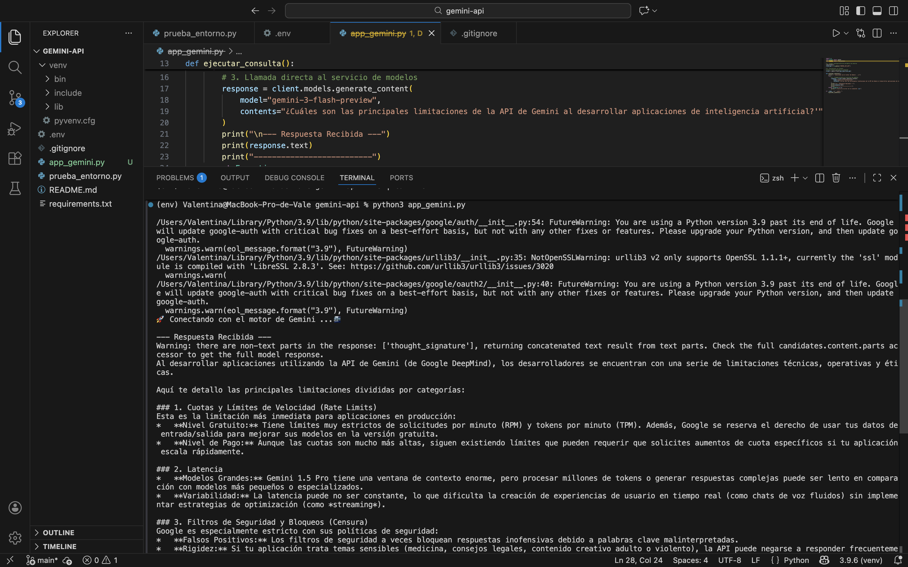

# Conexión a la API de Gemini
Ejercicio práctico que permite hacer la conexión a la API de Gemini usando Python para el curso de Desarrollo de Aplicaciones con IA

## Requisitos

- Python 3 instalado
- Cuenta en Google AI Studio
- API Key de Gemini
- VS Code

## Tecnologías usadas
- Python
- Google Gemini API
- python-dotenv
- google-genai

Estas instrucciones son para el entorno de macOS:

## Instalación / Configuración del entorno (macOS)

1. Clonar el repositorio:

git clone https://github.com/valentinalopezgrc/conexion-gemini-api.git
cd conexion-gemini-api

2. Crear entorno virtual:

python3 -m venv venv

3. Activar entorno virtual:
   
source venv/bin/activate

4. Instalar dependencias:
   
python3 -m pip install -r requirements.txt

5. Crear archivo .env:

Crear un archivo .env en la raiz de la carpeta del proyecto con el siguiente contenido:

GEMINI_API_KEY=TU_API_KEY_AQUI

Reemplazar con su clave personal.

⚠️ Este archivo NO debe subirse a GitHub.

## Ejecución del proyecto

## Prueba del entorno

python3 prueba_entorno.py

Debe mostrar:

Entorno activo

Ruta de Python

Conexión exitosa

## Conexión con Gemini

python3 app_gemini.py

El sistema mostrará una respuesta generada por la API de Gemini.

## Generación de dependencias

Las dependencias fueron generadas con:

python3 -m pip freeze > requirements.txt

## Evidencia

A continuación evidencia de la ejecución correcta del programa en la imagen adjunta.

Ejecución correcta del script `app_gemini.py` mostrando respuesta de la API de Gemini:

##  Realizado por:

Laura Valentina López García
Estudiante de ingeniería de Sistemas
Fundación Universitaria Konrad Lorenz

